# Sentiment Technical Analysis
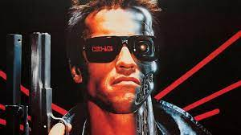

#### Contributors: Joseph Hagemann, Emilio Cubero, Preston Kirschner

## Objective
The goal of this project is to see if we could create a better predictive model for stocks than a typical technical indicator based model. We believe that unlike robots, humans are irrational and prone to react to emotion, which is why we decided to incorporate sentiment scores into our neural network. Our test was to determine if a predictive model with sentiment analysis would outperform a model without sentiment analysis. We found the best model to use for our interests and skill level would be a feed-forward tensorflow model to predict share close prices. This provides the savvy trader with a way to make buy/hold/sell decisions of their own incorporating both technical and fundamental components of trading. We created a “Main” notebook of code the user can pass their own ticker of interest into to perform the analysis. 

- Sentiment Features derived from Vader model on textual data from newsAPI
- Technical Features called in as historical DataFrame from Yfinance
- Feature Dataframes pulled in and Tensorflow model compiled and fit within Main

## Application 
Used to predict the medium term performance of a stock based on a combination of sentiment and technical analysis.

## Steps
1. Data extraction, cleaning, storage
2. Draft Project Proposal
3. Import libraries and dependencies
4. Utilize API call to gather articles that relate to a specific ticker
5. Run articles through VADER to perform sentiment analysis and create a dataframe that shows the sentiment analysis of the ticker over time
6. Clean the dataframe
7. Perform a groupby sum to consolidate the articles into their respective time stamps and weigh the sentiment analysis based off the frequency of the articles
8. Utilize API call to gather technical and price information that relates to the specific ticker
9. Merge the data frame that called information from Alpacas API with the dataframe that called information from News API to create a consolidated dataframe

## Notes on Execution

> We realized that we were limited by our resources to preform a merge on the dataframes of technical indicators and news sentiment. The issue was the news api could only take in a month's worth of data, but we were hoping to train on more. To solve this issue, we switched directions to utilize google trends over news sentiment. We preformed a google trends search, of 3 trends relevant to the stock of interest, as we felt this could also reflect the current sentiment of the stock.

## Technical Analyses Script:

Yahoo finance API call (yfinance)
Calls the technical information for the ticker and compiles it into a dataframe
Performs shifts to add additional columns that have up to three weeks backs worth of data and also adds a column that is used to predict next weeks close price
Indexes the datetime, drops nulls, and renames column to clean the dataframe so that it can merge with the google trends dataframe

## Google Trends Script:

Google trend API call (pytrends)
Calls 5 different searches on the ticker that cover a range of buy and sell sentiment
The sentiment for the searches are compiled into a dataframe
Shifts the index to match the date index of the technical dataframe for that ticker (Because the information is being analyzed on a weekly basis, this one day shift will have a minimal impact on the trends associated with that given week)
Renames the columns to show what was actually called from the API
Adjusts the datetime type to produce the final dataframe that can merge with the technical dataframe

## Neural Network Script:

Merges technical dataframe with trends dataframe
Runs a deep neural network on the merged dataframe to predict the ticker’s next

## Questions Asked of Data
Is the sentiment technical analysis model profitable?

## Model Analysis

Closing Prices
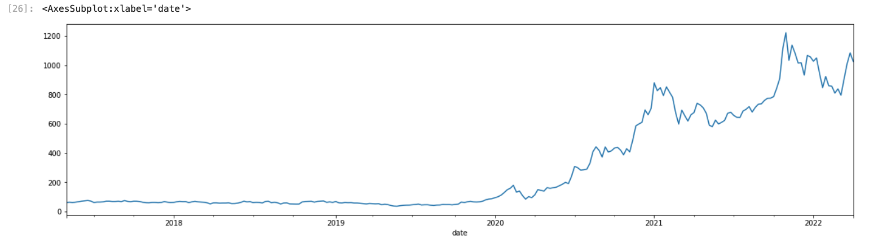

Trend Results
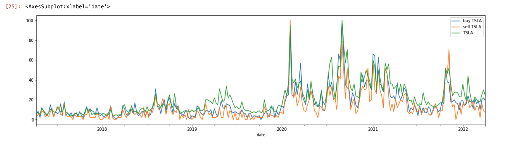

### Technical Model vs Technical & Trend Model

  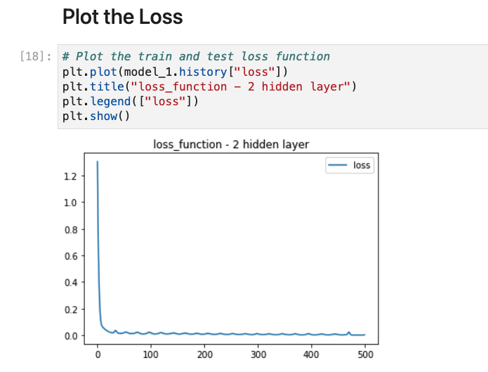
  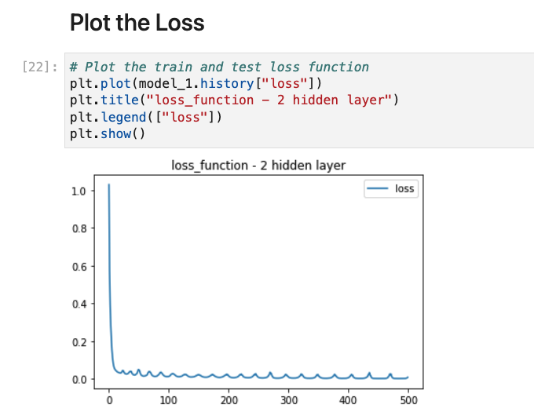 

Model Evaluate (Loss and MSE)

  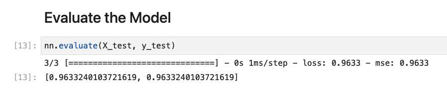
  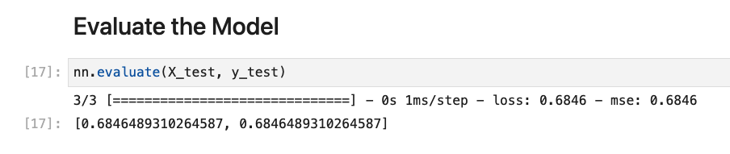 

Model Predictions DataFrame

  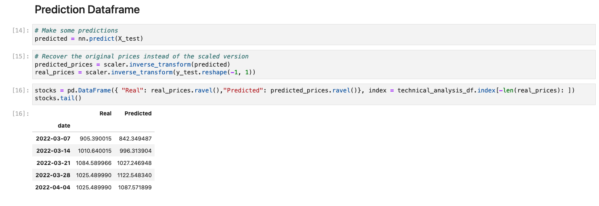
  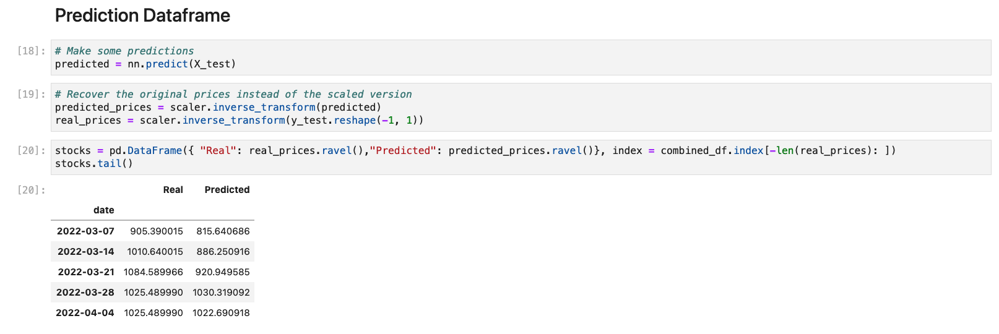 

Predictions Plot

  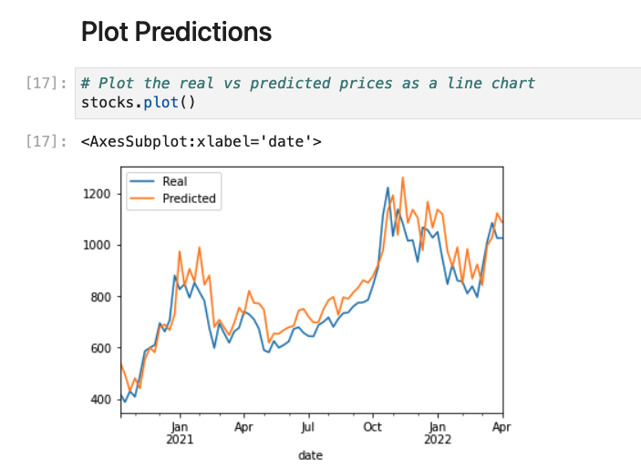
  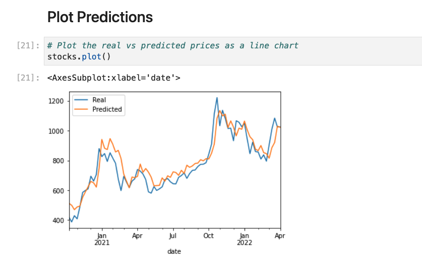 

## Limitations
> If you are using a Mac M1 chip you may need to run the tensorflow model in Google Colab.
> 
> Although Google Trends may measure some stock sentiment, it does not measure all the sentiment. It would be beneficial to include more sources such as social media networks like Twitter.
> 
> As sentiment analysis is still hard the score, measuring number of mentions is stronger for our purposes than relying on Sentiment Analysis engines such as Vader.

